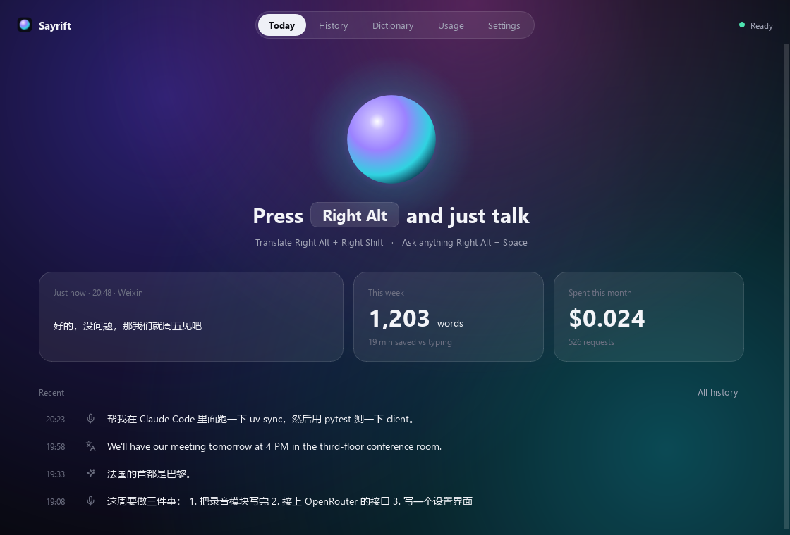

# Sayrift

**Windows 与 Android 上的语音输入工具。** 用自己的 OpenRouter key，完成听写、翻译和语音指令改写。

[English](README.md) · 简体中文



**0.2.1** · 原名 local-typeless。可直接下载安装，也可以用自己的 OpenRouter key 从源码构建。

- [Windows 11 安装包](https://github.com/TigerkidYang/sayrift/releases/download/v0.2.1/sayrift-Setup-0.2.1.exe)
- [Android APK](https://github.com/TigerkidYang/sayrift/releases/download/v0.2.1/sayrift-0.2.1-android.apk)
- [发布说明、校验值与依赖源码](https://github.com/TigerkidYang/sayrift/releases/tag/v0.2.1)

Windows 安装包目前没有代码签名。Android APK 使用 Sayrift 发布证书，不能直接覆盖旧的个人 debug 签名版本；不要为解决签名不匹配而卸载旧应用，详见[升级兼容说明](docs/compatibility.md)。

| 平台 | 当前状态 |
| --- | --- |
| Windows 11 | 桌面功能已可用，包含全局快捷键、语音浮条和系统托盘。 |
| Android 10+ | 预览版，通过边缘把手配合现有输入法使用。Android 13+ 的输入框集成更完整；已在小米 15、Android 16 / HyperOS 3、Gboard 上个人实测。 |

目前没有 iOS 版，也不支持 macOS、Linux 桌面。

## 三种语音模式

| 模式 | 用途 |
| --- | --- |
| **听写** | 将语音整理成文字，处理语气词、口头改正、标点和列表。 |
| **翻译** | 将语音转换成所选目标语言的文字。 |
| **Ask** | 选中文字后用语音要求改写，也可以在光标处写作，或在卡片中显示问题的答案。选区改写需要目标应用允许读取选区。 |

两端都有 Glass 界面、本地历史、人名和术语词典，以及用量和花费查看。Windows 还支持用历史录音重试、按模型查看花费和导出 CSV；Android 仅保存文字历史，不支持录音重试。两端的历史和词典独立保存，不做同步。

分级热词库仍是独立实验，**未集成进 0.2.1 发布版**。

## Windows 开始使用

下载并运行安装包，按首次引导设置即可，安装版不需要 Python 或命令行。

从源码运行时，准备 Python 3.12 和 uv，在源码根目录运行：

```powershell
uv sync --locked
uv run sayrift
```

`uv run sayrift-gui` 启动同一个应用，但不显示控制台窗口。构建安装包：

```powershell
uv run python tools/build_installer.py
```

产物为 `dist\sayrift-Setup-0.2.1.exe`，按当前用户安装，不需要管理员权限。

1. 在 Windows **用户环境变量**中添加 `OPENROUTER_API_KEY`，值为自己的 OpenRouter key，不要写进配置文件。
2. 打开 Sayrift，按首次引导检查 key、麦克风和快捷键。添加环境变量后，可以在引导中重新检测。
3. 点进输入框，开始录音，听到录音提示后说话。

| 操作 | 默认快捷键 |
| --- | --- |
| 听写 | 点按**右 Alt** 开始，再点一次结束；也可按住说话，松开结束。 |
| 翻译 | **右 Alt + 右 Shift**。 |
| Ask | **右 Alt + 空格**；想改写时先选中文字。 |
| 结束 / 取消 | 点按**右 Alt** 结束点按启动的录音；**Esc** 或 **×** 取消。 |

快捷键和翻译目标可在设置中修改。关闭主窗口后应用留在托盘，双击托盘图标重新打开，通过托盘菜单退出。

代理可在「设置 → 高级」中填写；未填写时先读代理环境变量，再读 Windows 系统代理。部分输入框和管理员窗口可能拒绝插入，可从结果卡片取回文字。限制和升级说明见[兼容性文档](docs/compatibility.md)。

## Android 开始使用

直接下载上方 APK。开发者也可按 [Android 构建说明](android/README.md)和[签名说明](android/signing.md)自行构建。

1. 安装 APK，打开 Sayrift。目前 Android 界面以中文为主。
2. 在引导中填写自己的 OpenRouter key，它会通过 Android Keystore 加密保存。
3. 按引导设置麦克风、通知、后台运行和无障碍权限。无障碍服务用于显示边缘把手和插入文字，打字继续使用原来的输入法。小米 / HyperOS 按引导开启自启动，并将省电策略设为无限制。
4. 点进支持的输入框，点击边缘把手录音，点 **✓** 结束或 **×** 取消；长按把手选择听写、翻译或 Ask。

Android 10–12 的插入方式限制更多。实际表现取决于手机、输入法和目标应用；密码框会主动隐藏把手。限制和升级时的签名要求见[兼容性文档](docs/compatibility.md)。

## 数据与隐私

Sayrift 需要联网。**录音和文字会提交给 OpenRouter 及所选模型服务商**，用于识别、整理、翻译和 Ask。请求中还可能包含词典、应用上下文，以及改写时的选中文字。

- **服务商路由：**默认通过 `data_collection = "deny"` 请求 OpenRouter 排除收集数据或用数据训练的服务商；这不保证零留存。Windows 另有默认关闭的可选 `zdr` 设置。
- **Windows：**历史是本地未加密的 SQLite 数据库，默认位于 `%APPDATA%\local-typeless\history.sqlite`，包含转写、结果，默认还保存用于重试的录音。可设置保留期限、关闭录音保存或关闭历史。
- **Android：**历史为本地未加密的 SQLite 文字和元数据，不保存历史录音。录音时使用临时缓存文件，正常结束或取消时删除；崩溃或清理中断可能留下文件。
- **Key：**Windows 从环境变量读取，Android 使用 Keystore 加密保存。历史记录不享有同样的应用层加密。
- **用量：**删除或关闭历史不会删除独立的用量和花费记录，这些记录保存元数据，不含转写文字和录音。

模型调用由你的 OpenRouter 账户付费。费用与响应时间取决于用量、模型、服务商和网络。应用中的花费统计依据服务返回的数据，可能不完整。

## 开发与项目说明

- [贡献指南](CONTRIBUTING.md)：环境、测试、构建和修改约定。
- [兼容性](docs/compatibility.md)：平台限制、保留的内部标识和旧版本升级。
- [配置示例](config.example.toml) · [架构](docs/architecture.md) · [手动验收](docs/manual-tests.md)。

Sayrift 是受 Typeless 启发的独立项目。部分设计和研究文档仍沿用旧名，或描述实验方向，不代表已发布功能。

**许可证：**Sayrift 自有代码及原创资源采用 [MIT](LICENSE)，第三方作品保留[各自许可证](THIRD_PARTY_NOTICES.md)。
